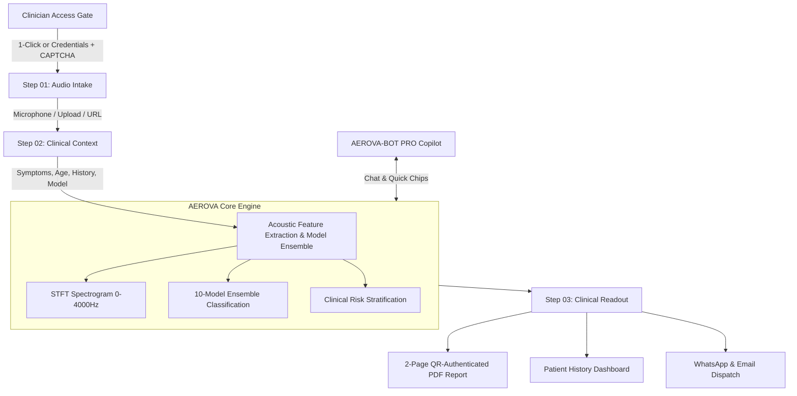

# AEROVA PRO v2.5 | AI Respiratory Triage & Robot Copilot

An enterprise hospital respiratory acoustic screening platform and AI clinical decision support system. AEROVA PRO analyzes non-invasive cough acoustic biomarkers using Mel-Frequency Cepstral Coefficients (MFCCs), spectral distribution metrics, and an ensemble of 10 trained scikit-learn machine learning classifiers, generating publication-grade medical documentation with QR authentication and clinical dispatch options.

---

## 🌟 Key Features & Sub-Pages

### 1. Enterprise Triage Gate (Authentication & Live Status)
- **Live Monitoring Metrics**: Live metrics cards tracking Active Cases, Extra Trees Triage Accuracy (84.6%), and Emergency Status (Level 2 ER Watch).
- **1-Click Instant Demo Access**: Immediate session provisioning for rapid triage checks.
- **Clinician Login**: Secure clinician credentials intake with dynamic math CAPTCHA generator (`What is X + Y?`).

### 2. Multi-Step Clinical Screening Workflow
- **Step 01 · Audio Intake**:
  - Live microphone intake with real-time waveform recording.
  - Multi-format file uploader (`.wav`, `.mp3`, `.webm`, `.ogg`).
  - Direct audio URL streaming and validation.
- **Step 02 · Clinical Context**:
  - Clinical symptom notes intake with natural language entity recognition.
  - Demographic parameters (Patient Age slider, Gender selector).
  - Pre-existing condition indicators (Asthma/COPD, Fever/Body aches).
  - Machine learning model selector (Extra Trees, Random Forest, AdaBoost, Bagging, Gradient Boosting, Logistic Regression, KNN, Decision Tree, SGD, SVC).
- **Step 03 · Clinical Readout & Medical Documentation**:
  - High-contrast clinical status card (`Healthy`, `Disease`, `Urgent review`) with confidence meter and risk tier (`low risk`, `medium risk`, `high risk`).
  - Clinical explanation panels ("What we heard", "Context signals", "Next best step").
  - Audio quality assessment (duration, signal level in dBFS, clipping percentage).
  - **Explainable Acoustic Spectrogram**: Dual-panel visualization featuring a 0–4000 Hz STFT frequency spectrogram and horizontal model probability distribution.
  - **Machine Learning Consensus**: 10-model prediction voting and benchmark validation accuracy table.
  - **Publication-Grade PDF Medical Report**: 2-page formal report containing patient demographics, acoustic readout, clinical summary, quality metrics, model comparisons, and embedded QR code authentication.
  - **Clinical Dispatch**: 1-click WhatsApp document sharing and native email draft generation.

### 3. Sub-Page: Patient History & Past Assessments
- Collapsible dashboard with assessment counter metrics (Total assessments, Flagged results, High-risk cases).
- Real-time search by Patient ID (`AUR-YYYYMMDD-HEX`).
- Historical table recording timestamps, readouts, risk tiers, and model confidences.

### 4. Sub-Page: AEROVA-BOT PRO · AI Robot Copilot Dock
- Animated SVG/CSS robot avatar with pulsating antenna indicator.
- Google Gemini 2.0 API connection for dynamic clinical reasoning.
- Autonomous intelligence fallback engine for offline cough analysis guidance.
- Quick prompt chips:
  - `🎙️ Recording Tips`
  - `🧠 ML Models`
  - `🩺 Result Meaning`
  - `📄 PDF Reports`

---

## 🏗️ Architecture Diagram



---

## 🚀 Quick Start

### 1. Clone & Setup Environment

```bash
# Clone the repository
git clone https://github.com/your-org/aerova-pro.git
cd aerova-pro

# Create and activate virtual environment
python -m venv .venv
# On Windows:
.\.venv\Scripts\activate
# On Linux/macOS:
source .venv/bin/activate

# Install dependencies
pip install -r requirements.txt
```

### 2. Run Locally

```bash
python app.py
```
Open your browser and navigate to:
```
http://localhost:7860
```

---

## ☁️ Deployment

### Deploy on Render
This repository includes ready-to-use `render.yaml` and `Procfile` configs:
1. Connect your GitHub repository to [Render](https://render.com).
2. Choose **Web Service** or use the **Blueprint** feature.
3. Build Command: `pip install -r requirements.txt`
4. Start Command: `python app.py`

### Deploy on Hugging Face Spaces
1. Create a new Space with the **Gradio** SDK.
2. Push this repository's files to your Space.
3. The application will launch automatically.

---

## 🔬 Machine Learning Benchmark Summary

| Model | Architecture | Validation Accuracy |
| :--- | :--- | :--- |
| **Extra Trees** *(Default)* | Extremely Randomized Trees Ensemble | **87.1%** |
| **Random Forest** | Bagged Decision Trees | **86.9%** |
| **Gradient Boosting** | Boosted Decision Stumps | **86.8%** |
| **Bagging** | Bootstrap Aggregation Ensemble | **86.4%** |
| **AdaBoost** | Adaptive Boosting Classifier | **85.7%** |
| **SVC** | Support Vector Classifier (RBF Kernel) | **84.3%** |
| **Logistic Regression**| L2-Regularized Linear Classifier | **83.9%** |
| **KNN** | K-Nearest Neighbors (k=5) | **82.5%** |
| **SGD** | Stochastic Gradient Descent Classifier | **82.1%** |
| **Decision Tree** | CART Classification Tree | **81.2%** |

---

## ⚖️ Legal & Medical Disclaimer
AEROVA PRO is an acoustic screening aid and clinical decision support tool designed to streamline hospital triage workflows. It does not provide medical diagnosis or replace consultation with qualified healthcare professionals. Patients presenting severe respiratory distress, acute chest pain, cyanosis, or rapid deterioration must seek immediate emergency medical care.
